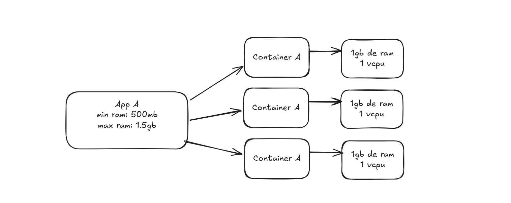

# Cenario

- Temos uma aplicação executando em container
    - A execução em container traz algumas preocupações

- Temos varias aplicações executando em container
    - Mais algumas preocupações

# Problemas 

- E se um container falhar na execução?

- E se precisarmos de varios container executando a mesma aplicação?

- E se precisarmos de um fluxo elastico?

- E se forem varias aplicacoes com varios containers?

- E o controle de uso de recursos de um container?

# Escalabilidade 

- Horizontal
    - HPA: O Horizontal Pod Autoscaler (HPA) ajusta automaticamente a quantidade de réplicas de pods com base no uso de CPU, memória ou métricas personalizadas.
    
- Vertical
    - VPA: O Vertical Pod Autoscaler (VPA) ajusta automaticamente os recursos (CPU e memória) solicitados pelos containers, sem alterar o número de pods.
     